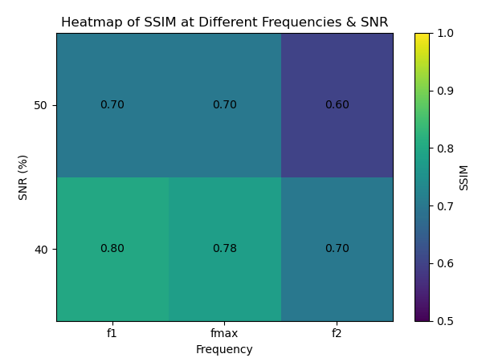

<head>
  
  
  
</head>

## Noise and undersampling simulation(18/03/2025)

The goal of this simulation is to try to figure out what would happen in our set up in which case we are going to have down-sampling(due to pixel size limitation) and noise issues. Also some metrics should be found to help us tell if the set up works as we expected.

---

### Review

**Downsampling**

> The maximum frequency that the sensor can detect below is replaced with $f_{max}$.
   
   Before the meeting(17/03/25), the way I simulate the downsampling is:

   1. Propagate the light from sample to sensor and get the hologram
   2. Down-sample the hologram. For example, if the pixel size ratio of image and sensor is 1:8 then I reserve the value of 1 pixel out of 8 pixels and do it in row and row. 
   3. Input the new down-sized hologram to do the reconstruction.
   
   Problem:

   I neglect $f_{max}$ and this may cause aliasing especially when high frequency is exsited in the image. So before I propagte the object field, I should first apply a fourier transform on the image and then filter it according to $f_{max}$. 

**Noise simulation**
   
First, I want to explain shot noise again because I found I used to have some misunderstandings. Because the generation of photons and electrons is discrete and random, when you want to discretize the signal, the number of photons or electrons detected at a given time is uncertain and follows a Poisson distribution. If the exposure time is long enough, the Poisson distribution can be approximated by a normal distribution. So both the noise from photon arrival and dark current generation are types of shot noise. They differ only in their origin. The former is due to the incoming light, and the latter is due to thermal effects within the sensor when don't have illlumination (the heat will also cause energy transition even without light and hense generate electrons).

In my case, now I should only focus on dark current noise and quantization noise. I don't understand why these two take the dominance. But at the very begining, maybe I can just take them all as a white Gaussian noise and then I can go deeper to consider these two noises.

### To do next

At first, I can just simply consider the noise as white Guassian noise. I will test how the reconstruction would be like with image of different level of filtering which means its maximum frequency can be $[f_{max}-\Delta,f_{max}+\Delta]$ and with different level of noise to see the influence of different SNR. I will try to give a reasonable range of noise and frequency (image) that can still get acceptable reconstruction results. I will use the datas to draw an image like the image below. Of course, it will be much more complex than this but just for example. When this is done, then I can go deeper in the noise considering quantization noise and dark current noise.

    <figure>
        
    </figure>

**This is what I'm going to do:**
1. Filter the image to different maximum frequencies $[f_{max}-\Delta,f_{max}+\Delta]$ .
2. Do forward propagation based on the filtered images to get $\text{hologram}_1\text{s}$.
3. Add different level of white Guassian noise on $\text{hologram}_1\text{s}$ to get $\text{hologram}_2\text{s}$.
4. Down sample $\text{hologram}_2\text{s}$ according to the sensor to get $\text{hologram}_3\text{s}$.
5. Reconstruct the filtered image based on $\text{hologram}_3\text{s}$.
6. Collect datas.
7. Analyse the datas and draw the graph.
   

