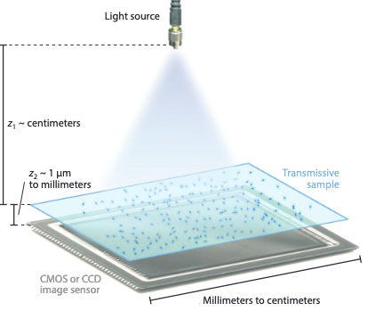

<head>
  <script async src="https://polyfill.io/v3/polyfill.min.js?features=es6"></script>
  <script async src="https://cdn.jsdelivr.net/npm/mathjax@3/es5/tex-mml-chtml.js"></script>
  <script>
    window.MathJax = {
      tex: {
        inlineMath: [['$', '$']],
        displayMath: [['\\[', '\\]'], ['$$', '$$']],
        processEscapes: true  // 允许 `$...$` 解析
      },
      svg: {
        scale: 1.2
      }
    };

    document.addEventListener("DOMContentLoaded", function() {
      MathJax.typesetPromise();
    });
  </script>
</head>

- [Lensless Microscope introduction](#lensless-microscope-introduction)
  - [What is lensless microscope?](#what-is-lensless-microscope)
  - [Holography and hologram](#holography-and-hologram)
  - [Angular spectrum method](#angular-spectrum-method)
  - [Hologram Acquisition](#hologram-acquisition)
  - [Iterative phase retrieval algorithm](#iterative-phase-retrieval-algorithm)
  - [Twin image and artifact](#twin-image-and-artifact)
  - [Shannon sampling criteria](#shannon-sampling-criteria)
  - [Noise issue](#noise-issue)
- [Sampling simulation with noise](#sampling-simulation-with-noise)
  - [Phase 1](#phase-1)

**Songhui Wang** 

30/03/2025

# Lensless Microscope introduction

## What is lensless microscope?

Lensless microscopy is a microscopic imaging system that does not require any lenses. It captures the hologram produced by the sample beam and reference beam, and then uses computational algorithms (such as iterative reconstruction algorithms) to convert these diffraction patterns into high-resolution images. This technology eliminates expensive and bulky optical components and has the advantages of small size, low cost, easy integration and portability. It is often used in applications such as portable diagnosis.


## Holography and hologram

In 1948, Dennis Gabor proposed a novel two-step, lensless imaging process which he called wavefront reconstruction. It's now called **holography**. When a suitable coherent reference wave is present simultaneously with the light diffracted by or scattered from an object, then the information about both the amplitude and phase of the diffracted or scattered waves can be recorded, although given the fact that the sensor can only record intensity information. The phase information somehow be converted to intensity variations for recording. The recording of the pattern of interference of the object wave and reference wave is called **hologram**. So in order to do lensless imaging, we should to make sure that the illumination we use is partially coherent. It shouldn't be equipped with strong coherence because the reflection light might interfere with the object light and hense cause artifacts. At the same time, the coherence must not be too weak, or the interference pattern cannot be properly recorded.

Holography is a two-step process which is image capture and reconstruction. For in-line holography, the illumination produces two kinds of beam. One is the reference beam $R$ . This beam remains unscattered which means there's no interaction with the object. Another beam is the object beam $O$. This beam has been scattered by the object. The degree of the coherence of illumination should be large enough to permit the reference and object beams to interfere with each other which giving rise to the interference pattern. This pattern's intensity is recorded by the sensor and is called hologram. It can be described by

$$|R+O| ^2 = |R|^2+|O|^2+R^*O+RO^*$$

$\|R\|^2$ is an uniform background signal and this contains no useful information. $\|O\|^2$ is a self-interference pattern. It's caused by the diffracted beams but normally its intensity is very low compared with other terms so it can be neglected. The last two terms are the dominant part in terms of our interest. They are proportional to the original obeject wave and its complex conjugate respectively. $RO^\ast$ this term is the cause of twin image artifact in in-line holographic imaging because this inverse curvature is produced by the conjugate object wave. In lensless microscope, we should try to do our best to mitigate its effects, but ultimately we can't eliminate it completely because it occurs due to physical limitations unless we turn to another holographic architecture which is off-axis. When the algorithm tries to reconstruct the image, it can't tell which one is the "true image" and which one is "twin image" because they have the same modulus when computing.


## Angular spectrum method

This is the method we use to simulate how the light propagates from the sample plane to sensor plane. In the IPR algorithm, we need to use angular spectrum method to simulate both forward and backward propagation multiple times. So it's very frequenctly used.

 Let the complex field across that $z=0$ plane be represented by $U(x,y,0)$ . The goal is to calculate the resulting field $U(x,y,z)$ that appears across some time which is parallel to the first plane with a distance $z$ .At $z = 0$ , The function $U(x,y,0)$ is given by

 $$A(f_x,f_y;0)=\iint _{-\infty}^{\infty}U(x,y,0)\exp[-j 2\pi(f_xx+f_yy)]dxdy$$

 $U(x,y,z)$ can be wrote as

  $$U(x,y,0)=\iint _{-\infty}^{\infty}A(f_x,f_y;0)\exp[j 2\pi(f_xx+f_yy)]dxdy$$

The plane wave can be described in a complex form:

$$p(x,y,z;t)=\exp[j(\vec{k}\cdot\vec{r}-2\pi v t)]$$

where $\vec{r}=(x,y,z)$, $\vec{k}=\frac{2\pi}{\lambda}(\alpha, \beta, \gamma)$, in which $\alpha ^2 + \beta ^2 + \gamma ^2 = 1$ . So if we write $A(f_x,f_y;z)$ in this complex form, it will turn to be 

$$A(f_x,f_y;z)=A(\frac{\alpha}{\lambda},\frac{\beta}{\lambda};z)=\iint _{-\infty}^{\infty}U(x,y,z)\exp[-j 2\pi(\frac{\alpha}{\lambda}x+\frac{\beta}{\lambda}y)]dxdy$$

then we have 

  $$U(x,y,z)=\iint _{-\infty}^{\infty}A(\frac{\alpha}{\lambda},\frac{\beta}{\lambda};z)\exp[j 2\pi(\frac{\alpha}{\lambda}x+\frac{\beta}{\lambda}y)]d\frac{\alpha}{\lambda}d\frac{\beta}{\lambda}$$

In addition, $U$ must satisfy the Helmholtz equation $\nabla^2U+k^2U=0$ at all source-free points. At this case, we only consider the $z$ direction, so we can write the solution like this

$$A(x,y,z)=A(x,y,0)\exp{(j\frac{2\pi}{\lambda}\sqrt{1-\alpha^2-\beta ^2}z)}$$

As a result, we must have $\alpha^2 + \beta ^2 <1$ or $f_x^2 + f_y ^2< \lambda ^2$, otherwise $z$ will only have imaginary solution and this wave can't propagate at far field and will attenuate to a level that is almost negligible within a certain distance. **So that is our support area in frequency domain.**

Then we replace $A(x,y,z)$ with the Helmholtz equation's solution, we have

  $$U(x,y,z)=\iint _{-\infty}^{\infty}A(\frac{\alpha}{\lambda},\frac{\beta}{\lambda};0)\exp{(j\frac{2\pi}{\lambda}\sqrt{1-\alpha^2-\beta ^2}z)}\exp[j 2\pi(\frac{\alpha}{\lambda}x+\frac{\beta}{\lambda}y)]d\frac{\alpha}{\lambda}d\frac{\beta}{\lambda}$$

or we can write in a more simple form:

$$U(x,y,z)=\mathcal{F}^{-1}\{\mathcal{F}\{U(x,y,0)\}\cdot H(x,y,z)\}$$

**Code Simulation:**

In practice, it's not so hard to simulate the angular spectrum method. The only difficulty is to calculate the frequency index. The frequency index can be calculated by 

$$f_x=\frac{k_x}{\Delta x},f_y=\frac{k_y}{\Delta y}$$

$k_x,k_y$ is the index of the discretized grid and $\Delta x, \Delta y$ is the spatial sampling distance of the sensor. This can be written more detailly as 

$$f_x = \frac{x-\frac{N}{2}-1}{N\times \Delta x},f_y = \frac{y-\frac{N}{2}-1}{N\times \Delta y}$$

$N$ is the number of the pixels, $x,y$ is the spatial coordination without centralization. If the coordination is already centralized then it can be simplified as

$$f_x = \frac{W}{N\Delta x},f_y = \frac{H}{N\Delta y}$$

$W,H$ is the centralized spatial grid index. Then all the work remained is to write the codes according to the angular spectrum method calculation process. The whole process is shown below.

    def Transfer_function(W, H, distance, wavelength, pixelSize, numPixels):
        FX = W / (pixelSize * numPixels) # Calculate the index of frequency grid
        FY = H / (pixelSize * numPixels) # Calculate the index of frequency grid
        k = 2 * np.pi / wavelength 
        square_root = np.sqrt(1 - (wavelength ** 2 * FX ** 2) - (wavelength ** 2 * FY ** 2))
        valid_mask = (wavelength ** 2 * FX ** 2 + wavelength ** 2 * FY ** 2) <= 1
        square_root[~valid_mask] = 0
        temp = np.exp(1j * k * distance * square_root)
        return temp

    def angular_spectrum_method(field, pixelSize, distance, W, H, numPixels):
        GT = fftshift(fft2(ifftshift(field)))
        transfer = Transfer_function(W, H, distance, 532e-9, pixelSize, numPixels)
        gt_prime = fftshift(ifft2(ifftshift(GT * transfer)))
        return gt_prime


## Hologram Acquisition

As we are already equipped with hologram knowledge and angular spectrum method, we can simulate our hologram. The first step, of course is to read the sample image and in this step it's better to normalize the image while reading it because this can facilitate calculation and give us a more intuitive feeling. 

    # --- Define the image reading function ---
    def load_and_normalize_image(filepath):
      image = Image.open(filepath).convert('L') # Read image and convert into grayscale
      grayscale_data = np.array(image, dtype=np.float32) # Store the data into a Numpy array in float32 form
      return (grayscale_data - grayscale_data.min()) / (grayscale_data.max() - grayscale_data.min()) # Normalization

    # --- Read image ---
    object = load_and_normalize_image('pic/full_image.png')

```.convert('L')``` is to convert the image to grayscale (single channel), ```'L'``` represents luminance.

Then we should define sensor plane and its corresponding spatial grid. The sensor's pixel size can be assumed as $1.6 \mu m$ . To make it be aligned wth the sample image, we better to set the number of pixels the same as the dimension of the image. Otherwise, we need to do downscaling on hologram field to respect the physical limitation. So now let's just make it simple. When defining the spatial grid, It is best to put $(0, 0)$ in the center of the array, otherwise it is usually in the upper left corner of the array by default.

    # --- Set pixel size of the image and sensor ---
    sensor_pixel_sizes = 1.6e-6  # 1.6µm for sensor
    numPixels_image = 1024  # The dimension of the image
    
    # --- Define the spatial grid ---
    x = np.arange(numPixels_image) - numPixels_image / 2 - 1
    y = np.arange(numPixels_image) - numPixels_image / 2 - 1
    W, H = np.meshgrid(x, y)

After that, It is to define the sample properties. In this work, we assume a sample–sensor distance of $0.005 m$. However, in practice, this distance is often around $0.001 m$ or even smaller. When the sample is very close to the sensor, the resulting diffraction or scattering pattern does not spread excessively, thereby preserving more fine details and facilitating subsequent numerical reconstruction. We have the amplitude absorption which can be represented as $I = I_0 \exp (-\alpha L)$. Here ```1.6``` is $\alpha$ which is the absorption index and the sample absorption is approximately $80\%$. Phase delay is $\Delta \phi = k \Delta n L$ and ```ph0``` is the phase modulation index which equivalent to $k\Delta n$. The grayscale value can be understanded as ```L```. That is the thickness of the sample. When $L$ equals to $0$, means the thickness is $0$ and there is no absorption and phase delay.

    # --- Sample to sensor distance ---
    z2 = 0.005  

    # --- Define the sample field ---
    am = np.exp(-1.6 * object)
    ph0 = 3
    ph = ph0 * object_filtered
    object_field = am * np.exp(1j * ph)
    am_object_field = np.abs(object_field)
    plot_image(am_object_field)

The last step is to use angular spectrum method to propagate the sample field to the sensor plane and read its intensity to plot the image.

    # --- Acquire the hologram ---
    hologram_field = angular_spectrum_method(object_field, sensor_pixel_sizes[0], z2, W, H, 1024)
    am_hologram = np.abs(hologram_field)
    # plot_image(am_hologram)

Here, I can give an simple example. This is the grayscale image.

<div align="center">
    <figure>
        
    </figure>
</div>

Then this is the field that just pass the sample.  

<div align="center">
    <figure>
        
    </figure>
</div>

And this is the hologram I got.

<div align="center">
    <figure>
        
    </figure>
</div>

## Iterative phase retrieval algorithm

I learned about two kinds of IPR algorithm. One is Gerchberg-Saxton algorithm and one is steepest descent method. They are different two ways to recover the phase information. GS algorithm estimates the missing phase information by alternating projections between two domains (usually spatial and Fourier). By continuously modifying the amplitude and phase constraints, it can converge to a reasonable solution. Many algorithms are developed based on GS algorithm. For example, Error reduction method(1978), In-and-out method(1978), Hybrid in-and-out method(1986) and around 2013 the most often used algorithm was invented. 

Error reduction method uses a very classic idea, that is 

1. First input an intial guess $g_k(x)$.
2. Do the fourier transform getting $G=\|G\|e^{I\phi}$ .
3. Update the fourier modulus with the recorded modulus $G=\|F\|e^{I\phi}$.
4. Do an inverse fourier transform and apply object constraints.For example like amplitude non-negativity. If at some points, it doesn't satisfy the constraint then just simply set it as $0$ . At last, $g_{k+1}$ is obtained.
5. Repeat the process untill find a convergence.
   
However, normally it's not practical for 2D image because in most of this case, the error function can decrease rapidly but afterwards the convergence rate will become very slow and hense not very practical. 

In-and-out method achieves some improvements by optimizing the applied constraint which is in step 4, Before, the constraint is very strong that only points that satisfy the constraints will continue keeping their values. This can create sharp discontinuities at object boundaries, which can easily cause artifacts or "edge effects". These unnatural jumps may interfere with subsequent iterations and cause the results to deviate from the true solution. Also  this may remove some faint but important structural information in real objects. In-and-out method has a certain tolerance range for prior information of objects (such as finite support, non-negativity, etc.). It's like 

$$g_{k+1}(x)=\begin{cases}g_{k}(x),&x\notin\gamma\\g_{k}(x)-\beta g_{k}{}^{\prime}(x),&x\in\gamma&\end{cases}$$

where $\gamma$ is the set of points that do not satisfy the object constraints. Due to this method has more reasonable constraints, it can reach a better reconstruction result. For hybrid in-and-out method, It may dynamically adjust $\beta$ or use a stronger update strategy when the constraints are continuously violated, so as to better escape the local optimum and avoid stagnation.

Now comes to the algorithm I used in my codes.  Its idea is to use angular spectrum method and make propagations between the sample plane and the sensor plane to reconstruct the losing phase information. It can be described as below.

1. Make an initial guess $h_k(x)$ as input.
2. Apply backward-propagation on $h_k(x)$ and propagate it to the object plane. 
3. Apply the amplitude non-negativity constraint to get $g_k(x)$ .
4. Apply forward-propagation on $g_k(x)$ and propagate it back to the sensor plane.
5. Apply the intensity constraint. Then get $h_{k+1}$ .
6. Repeat step 2 to 5 untill reach a convergence.
  
**Code Simulation**

    def IPR(Measured_amplitude, distance, iteration_number, convergence_threshold, pixelSize, W, H, numPixels, object_field):
      update_phase = [] # Restore the phase 
      last_field = None # Restore the field when reaching the convergence
      rms_errors = [] # Restore the RMS error
      ssim_errors = [] # Restore the SSIM error
      # --- The iteration process ---
      for k in range(k_max):

          # a) Sensor plane
          if k == 0:
              phase0 = np.zeros(Measured_amplitude.shape)
              field1 = Measured_amplitude * np.exp(1j * phase0)
          else:
              field1 = Measured_amplitude * np.exp(1j * update_phase[k - 1])

          # b) Backpropagation and apply constraint
          field2 = angular_spectrum_method(field1, pixelSize, -distance, W, H, numPixels)
          phase_field2 = np.angle(field2)  # phase
          amp_field2 = np.abs(field2)  # amplitude
          abso = -np.log(amp_field2 + 1e-8) #1e-8 to prevent 0 value
          # Apply constraints
          abso[abso < 0] = 0
          phase_field2[abso < 0] = 0
          amp_field2 = np.exp(-abso)
          field22 = amp_field2 * np.exp(1j * phase_field2)

          # c) Forward propagation
          field3 = angular_spectrum_method(field22, pixelSize, distance, W, H, numPixels)
          amp_field3 = np.abs(field3)
          phase_field3 = np.angle(field3)
          update_phase.append(phase_field3)
          # d) Backpropagate to get the image
          field4 = angular_spectrum_method(field3, pixelSize, -distance, W, H, numPixels)
          amp_field4 = np.abs(field4)
          last_field = field4

          # Error calculation
          if k > 0:
              rms_error = np.sqrt(np.mean((amp_field_after - amp_field4) ** 2))
              rms_errors.append(rms_error)
              print(f"Iteration {k}: RMS Error = {rms_error}")
              ssim_value = ssim(amp_field_after, amp_field4, data_range=amp_field_after.max() - amp_field_after.min())
              ssim_errors.append(ssim_value)
              print(f"Iteration {k}: SSIM = {ssim_value}")
              # threshold
              if rms_error < convergence_threshold:
                  print(f"Converged at iteration {k}")
                  return last_field, rms_errors, ssim_errors
      return last_field, rms_errors, ssim_errors

I can give two example here to show how is the reconstruction. The sample-sensor distances are all $0.005m$ and sensor's pixel sizes are $1.6\mu m$. For the first image, the SSIM value is 0.7008 and its RMS error is 0.0801. For the second image, the SSIM value can achieve 0.8842 and its RMS error is 0.0261. RMS error can reflect the overall reconstruction quality. The RMS error of the first image is much larger than that of the second image and this can be easily seen from the reconstructed image that the first image has more artifacts and objects are not well reconstructed. SSIM is a measure of the similarity between two images in terms of structure, brightness and contrast. So both of the reconstructions achieve a relatively good value. For the first image, although It looks not well reconstructed(with many artifacts), it does successfully reconstruct the struture and we can observe the objects' distribution. As for the reason why the same IPR algorithm's reconstruction quality varies so much between these two images, I will talk about it in the next chapter.

<div style="display: flex; justify-content: space-between;">
  <div style="flex: 1; padding: 5px;">
    
  </div>
  <div style="flex: 1; padding: 5px;">
    
  </div>
</div>

<div style="display: flex; justify-content: space-between;">
  <div style="flex: 1; padding: 5px;">
    
  </div>
  <div style="flex: 1; padding: 5px;">
    
  </div>
</div>

For this IPR algorithm, it's just based on one-shot hologram so the reconstruction quality of course is limited. Now based on this algorithm, many methods are invented to make more measurements not just once to achieve a better reconstruction quality. For example, they introduce multi-angle recording and multi-heights measurements. Their setups are shown below. For multi-angle illumination, this method can shift the high frequency that once we can't record to the frequency which is within our spectrum support that can be recorded. Beside just by introducing multiple measurements, they also apply the super pixel resolution method to achieve an effect which can reduce the physical pixel size limitation through a computational way. Also, there are methods that apply multiple wavelengths during the reconstruction in recent five years but I won't introduce here.

<div align="center">
    <figure>
        
    </figure>
</div>

<div align="center">
    <figure>
        
    </figure>
</div>

Then the last is the steepest descent method. This is a general optimization algorithm used to minimize the objective function. Its basic idea is to calculate the gradient of the objective function at the current estimate, and then update the parameters along the negative direction of the gradient to gradually approach the local optimal solution. Its steps are like 

1. Input the Initial guess $g(x)$.
2. Do the fourier transform and update it with recorded fourier modulus $g'(x)$ and keep its phase unchanged.
3. Calculate the error function $B$ which is our obeject function.
4. Do a partial derivative on $B$ to get  $\frac{\partial B}{\partial g(x)}$ and estimate the a proper step size $\alpha$.
5. Update the field by $g_i(x)=g_{i-1}(x)+\alpha \times (\frac{\partial B}{\partial g(x)})$ .
6. Repeat step 2 to step 5 until reach a convergence.

## Twin image and artifact

In the previous chapter, I analyzed the reconstruction result but why the two different images have very different reconstruction quality under the same IPR algorithm? According to J.R. Fienup's paper "Phase-retrieval stagnationproblems and solutions", it's said that this IPR algorithm which based on one-shot hologram does not behave well for symmetrical objects and dense samples. My reconstruction results proved this but why there always exsits artifacts and twin images?

For artifacts,iterative phase-retrieval algorithm does not guarantee a global minimum. The algorithm can get stuck in local minima, causing artifacts. Also, at this moment (as far as I know about the IPR algo) no perfect constraints are found to smoothly regulate the reconstruction process. The two constraints I apply will forcibly truncate certain values, which can lead to discontinuities and hence cause artifacts. However, If the reconstruction is based on multiple measurements, this effect will be hugely reduced but in my case it's just one-shot hologram so it's hard to achieve an 'artifact-free' effect.

For twin images, It's also very hard to be eliminated. Although the hologram can only record the intensity but the phase information somehow is converted to intensity variations that's why we can reconstruct the phase based on the hologram. However, since only the intensity is available, the algorithm will reconstruct both the true image and conjugate image at the same time because the algorithm itself can't tell their difference(they have the same modulus). For in-line  holography, now we can only alleviate this problem to the maximum extend but we can't eliminate it because it's due to the physical limitation. However, if we want to avoid this problem, off-axis holography can be used.

Although we cannot completely eliminate them, through proper algorithm design and constraint imposition, they may be effectively suppressed in the final reconstruction result so that we cannot "see" their existence.

> Besides, if we want to image a dense sample, multi-height imaging method is approved to be very useful.

## Shannon sampling criteria

According to the Shannon sampling theorem, in order to perfectly recover a band-limited signal, the sampling frequency must be at least twice the maximum frequency present in the signal.

First, we have the spectrum support and we can get the range of wave number.

$$k_x^2+k_y^2 \leq (\frac{1}{\lambda})^2 \rightarrow k_x,k_y \in (0,\frac{1}{\lambda}]$$

then

$$f = \frac{k}{2\pi}\rightarrow f_{max} = \frac{k_{max}}{2\pi}=\frac{1}{\lambda}$$

So we can get the maximum frequency is related to minimum wavelength that is used and the sensor's sampling frequency must larger than or equal to $\frac{2}{\lambda _{min}}$ . Hence, the sampling distance should be smaller than or equal to $\frac{\lambda _{min}}{2}$ . If the wavelength I use is $0.532 \mu m$, then for the sensor its maximum pixel size can be calculated as

$$\Delta x \leq \frac{0.532}{2}=0.216\mu m$$

However, in real life there's no exsiting sensor with such small pixel size. So we will definitely have down-sampling situation which means the sensor will lose some high frequency information. As a result, the reconstruction will miss some details. Here I give an example. Below is the original image and the filterd image.

<div align="center">
    <figure>
        
    </figure>
</div>

Due to the loss of high frequency part, we can never reconstruct the original image based on this one-shot hologram. The best case we can have is to perfectly reconstruct the filtered image. Below is the reconstruction result.

<div align="center">
    <figure>
        
    </figure>
</div>

## Noise issue

In practice, the detection will definitly include noise and this will influence the reconstruction result in a negative way. We normally consider the following two kinds of noise.

1. **Shot noise and dark current noise**
    The generation of photons and electrons is discrete and random, when you want to discretize the signal, the number of photons or electrons detected at a given time is uncertain and follows a Poisson distribution. If the exposure time is long enough, the Poisson distribution can be approximated by a normal distribution. So both the noise from photon arrival and dark current generation are types of shot noise. They differ only in their origin. The former is due to the incoming light, and the latter is due to thermal effects within the sensor when don't have illlumination (the heat will also cause energy transition even without light and hense generate electrons).

    **Code simulation**
    Before the simulation, we should have a knowledge of the full well capacity. Full well capacity of a sensor represents the maximum number of electrons that each pixel can store. For IMX477 its full well capacity is around $8000e^-$. Then I can set $8000e^-$ as the scaling factor to transform the ideal intensity of the hologram to a form in electrons. Normally, the intensity of the hologram is normalized and its range is from 0 to 1. Now I can control the level of this noise by choosing the number of noise electrons which will influence the standard variance of the normal distribution. The code is shown below.

    > Notice: Don't forget to transform the field back to intensity.

        scaling_factor = 8000 # Assume full well capacity is 8000e-
        ideal_intensity = (am_undersampled_hologram ** 2) * scaling_factor # Transform intensity to the scale of photons or electrons
        noise_electrons = 750 # Choose the number of noise electrons
        noise_standard = noise_electrons / scaling_factor # Transform noise form scale of electrons to scale of intensity
        Dark_current_noise = np.random.normal(0, noise_standard, ideal_intensity.shape) # Simulate the noise


2. **Quantization noise**
   Quantization noise is the error generated in the process of converting a continuous analog signal to a discrete digital signal. When the ADC (analog-to-digital converter) maps a continuous signal to a finite number of discrete levels, some subtle changes in the original signal are lost, and this error is called quantization noise.

   **Calculation**

   If the bit depth of the sensor is $B$, then the range of discrete series can be calculated as 

   $$L=2^B - 1$$
   
   For the normalized signal (from 0 to 1), the quantized value is 
   
   $$Q(x) = \frac{\text{round} (x\cdot L)}{L}$$
   
   then the quantization noise is 
   
   $$e=Q(x)-x$$

   **Simulation**

            # --- Assume the bit depth of the sensor is 12 ---
            L = 2**12 - 1
            image_quantized = np.round(image * L) / L
            quant_error = image_quantized - image


---

# Sampling simulation with noise

The goal of this simulation is to try to figure out what would happen in our set up in which case we are going to have down-sampling(due to pixel size limitation) and noise issues. Also some metrics should be found to help us tell if the set up works as we expected.

## Phase 1

At this stage, the noise would be simplified as a white Guassian noise. When this simulation is done, I would then go deeper in the noise simulation considering different ratio of different noises. 

In phase 1, the following work is done:

1. Filtering the original image according to the cut-off frequency $f_{max}$ based on the sensor according to the Shannon sampling criteria.
2. Apply forward-propagation on the filtered image to get the hologram.
3. Sample the hologram field.
4. Add different levels of noise on the sampled hologram to simulate the real life case.
5. Reconstruct the image based on the IPR algorithm and collect datas.
6. Change the cut-off frequency $f_{cut} \in [f_{max}, f_{max} + \Delta]$ and repeat step 2 ~ 5 to analyze the reconstruction when it is under under-sampling. 

**First** I want to show the reconstruction results without any noise but with cut-off frequencies from $f_{max}$ to $f_{max} + \Delta$ to see the reconstructions when having different levels of down-sampling. In the image below, on the left is the original image and on the right is the filtered image. As can be seen, the amplitude of the filtered image is smaller because it loses some energy when filtering and the edges of the small circles are not as sharp as the original image. This is also due to filtering, it loses the high frequency parts and hence loses some details.

> There would be many filtered image based on different cuf-off frequencies and this one is just for example.

<div style="display: flex; justify-content: space-between;">
  <div style="flex: 1; padding: 5px;">
    
  </div>
  <div style="flex: 1; padding: 5px;">
    
  </div>
</div>

This image below shows a decrease in SSIM when the cut-off frequency goes larger and larger. $f_0$ is the maximum frequency that the sensor can detect which is $f_{max}$. With the index increasing by $1$, the cut-off frequency increases by $10\%$ . For example, $f_2$ is $120\%$ of $f_0$ . The SSIM metric decreases because the additional frequencies beyond $f_0$ are not present in the captured data. Thus, including them (or attempting to reconstruct them) introduces artifacts and aliasing, degrading the overall reconstruction quality. The SSIM does not change since $f_4$ because the maximum frequency of the image is between $f_3$ and $f_4$. Therefore, even if the cutoff frequency is increased, there will be no change because all the frequencies of the image have been included. This is in line with the expectation.

<div align="center">
    <figure>
        
    </figure>
</div>

In conclusion:

- **At $f_0$**, the cutoff frequency matches the sensor’s maximum frequency so only valid, alias-free frequencies are included.
- **From $f_0$ to $f_4$**, increasing the cutoff gradually introduces frequencies that the sensor could not detect, which degrades reconstruction quality as measured by SSIM.
- **Beyond $f_4$**, SSIM plateaus because the maximum frequency of the image is already smaller than the cut-off frequency and keep increasing the cut-off value won't introduce any undetected information so the SSIM plateaus.

I can give more examples, below is the another filtered image and it's SSIM curve. The result is basically the same.


<div align="center">
    <figure>
        
    </figure>
</div>

<div align="center">
    <figure>
        
    </figure>
</div>

**Then**, still use the first sample shown before but this time noise is added. The test results are shown in the heat map below. It can be concluded that when noise is added to the same sample, for any cutoff frequency, having a higher SNR consistently has a better reconstruction. In other words, noise level becomes the dominant factor: even if you optimize the cutoff frequency, excessive noise can still degrade the image quality significantly. Conversely, if noise is minimal (i.e., SNR is high), the reconstruction tends to remain relatively good even if the cutoff frequency is not perfectly set. Hence, in this scenario, the influence of noise on the reconstructed image's quality outweighs that of the cutoff frequency.

<div align="center">
    <figure>
        
    </figure>
</div>

The following picture can give you a more intuitive feeling of the impact of SNR on reconstruction. The SNR of the left and right image is 43 dB and 19 dB separately. Their corresponding SSIM is around 0.7 and 0.5 respectively. [The original image is shown before you can click here to check.](./reportM1_pic/样本二原图.png)


<div style="display: flex; justify-content: space-between;">
  <div style="flex: 1; padding: 5px;">
    
  </div>
  <div style="flex: 1; padding: 5px;">
    
  </div>
</div>

I think we can use SSIM and RMS to analyze the quality of reconstruction. RMS can measure the overall quality of reconstruction, while SSIM can better reflect the reconstruction quality of details and is more in line with our eye's intuitive feeling. However, to use SSIM, we need a traditional microscope to image the sample to obtain the "real image" we need.


