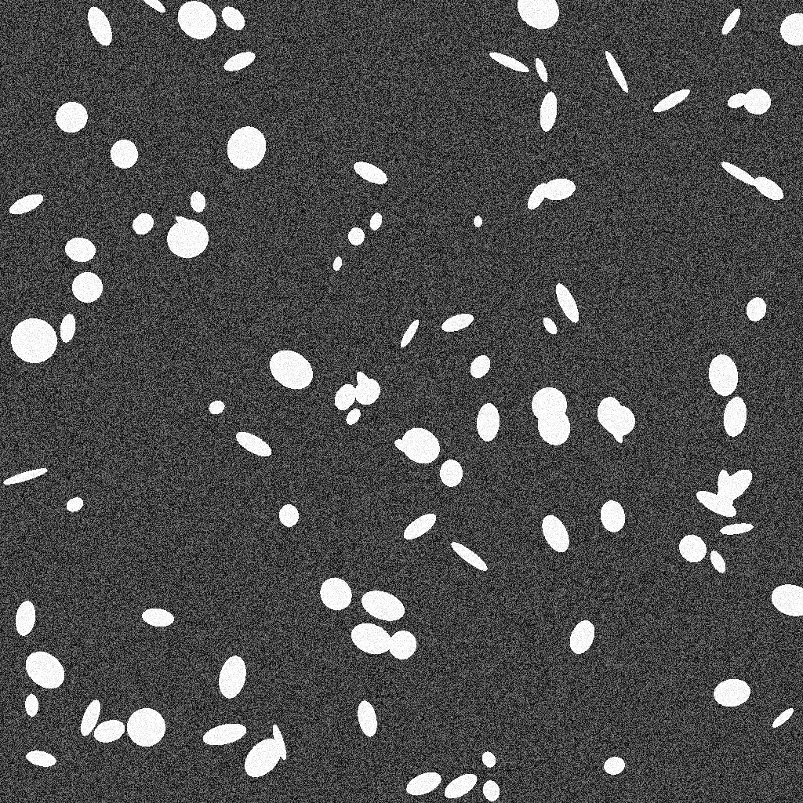
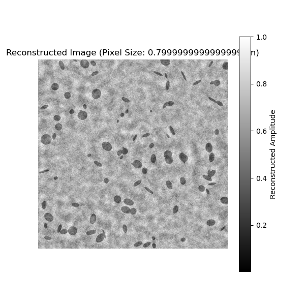

<head>
  
  
  
</head>

<!DOCTYPE html>
<html>
<head>
  
</head>
<body>
  

    <ul class="toc" id="toc"></ul>
  

  <button class="toggle-btn" id="toggleBtn">◀</button>

  <!-- 原始内容保持完全不变 -->
  

    <h2>Sample</h2>
    
It is a random generated sample...

    
    <h2>Shannon sampling criteria</h2>
    
If we want to recover...

    <h2>Simulation method</h2>
    
I wanted to test...

    <h2>Test</h2>
    
1. Ideal case...

    <h2>Conclusion</h2>
    
I think the RMS error...

  

  
</body>
</html>

# Under-sampling simulation

## Sample 

It is a random generated sample with $1024 \times 1024$ resolution. I added some white Guassian noise to simulate the random noise while imaging. Due to in lensless microscope the FOV is equal to the active area on the sensor chip which is nearly equal to the size of the sample. So the **FOV** here is $204.8\mu m \times 204.8\mu m$ .

    <figure>
        
    </figure>

## Shannon sampling criteria

If we want to recover the signal without any loss we must obey the Shannon sampling criteria, so we can have the minimum sampling distance by as follows: 

$$K_{max}=\frac{2\pi}{\lambda_{min}}\rightarrow f_{max}=\frac{k_{max}}{2\pi}=\frac{1}{\lambda}\rightarrow \Delta x \leq \frac{\lambda_{min}}{2}$$

I assume we use the light of wavelength at $532nm$, so we can get **the minimum sampling distance** $\Delta x = 0.266 \mu m$

## Simulation method

I wanted to test the IPR reconstruction with the same sample under different pixel sizes but there would be a **difficulty** for code simulation.

    def angular_spectrum_method(field, pixelSize, distance, W, H, numPixels):
        GT = fftshift(fft2(ifftshift(field)))    ## The matrix size is 1024*1024
        transfer = Transfer_function(W, H, distance, 532e-9, pixelSize, numPixels)  ## The matrix size is 52*52
        transfer = resize_transfer_function(transfer, field.shape)
        gt_prime = fftshift(ifft2(ifftshift(GT * transfer)))  ## The matrix size is different so will cause error
        return gt_prime

    <figure style="margin: 10px; text-align: center;">
        
    </figure>
    &harr;
    <figure style="margin: 10px; text-align: center;">
        
    </figure>

## Test 

**1. Ideal case with $0.2 \mu m$ pixel size**

$$
\begin{array}{c|c}
\textbf{RMS} & \textbf{SSIM} \\
\hline
2.47 \times 10^{-16} & 0.9999
\end{array}
$$

$$\text{RMS}=\sqrt{\frac{1}{n}\sum _{i=1}^n(\text{Reconstructed amp}_{i}-\text{Recorded amp}_i)^2}$$

, $i$ is the pixel index.

    <figure>
        
        <figcaption>Figure 1.1: Sample reconstructed</figcaption>
    </figure>

    <figure>
        
        <figcaption>Figure 1.2: Convergence figure</figcaption>
    </figure>

**2. Under-sampling with $0.8 \mu m$ pixel size**

$$
\begin{array}{c|c}
\textbf{RMS} & \textbf{SSIM} \\
\hline
2.63 \times 10^{-16} & 0.9999
\end{array}
$$

    <figure>
        
        <figcaption>Figure 2.1: Sample reconstructed</figcaption>
    </figure>

    <figure>
        
        <figcaption>Figure 2.2: Convergence figure</figcaption>
    </figure>

🚩**3. Under-sampling with $1.6 \mu m$ pixel size** (If we use IMX477 then this is the circumstance)

$$
\begin{array}{c|c}
\textbf{RMS} & \textbf{SSIM} \\
\hline
2.54 \times 10^{-16} & 0.9999
\end{array}
$$

    <figure>
        
        <figcaption>Figure 3.1: Sample reconstructed</figcaption>
    </figure>

    <figure>
        
        <figcaption>Figure 3.2: Convergence figure</figcaption>
    </figure>

**4. Under-sampling with $2.4 \mu m$ pixel size**

$$
\begin{array}{c|c}
\textbf{RMS} & \textbf{SSIM} \\
\hline
2.66 \times 10^{-16} & 0.9999
\end{array}
$$

    <figure>
        
        <figcaption>Figure 4.1: Sample reconstructed</figcaption>
    </figure>

    <figure>
        
        <figcaption>Figure 4.2: Convergence figure</figcaption>
    </figure>

## Conclusion

I think the RMS error can't really reflect the reconstruction quality because the RMS errors of them are nearly the same but the ringing effect can be seen around the elements when we have under sampling and it becomes more and more serious as the undersampling becomes more severe. I'm looking for a parameter that can reasonably reflect the quality of the reconstruction.

    <figure style="margin: 10px; text-align: center;">
        
        <figcaption>Ideal case</figcaption>
    </figure>
    <figure style="margin: 10px; text-align: center;">
        
        <figcaption>0.8 micrometer</figcaption>
    </figure>
        <figure style="margin: 10px; text-align: center;">
        
        <figcaption>1.6 micrometer</figcaption>
    </figure>
        <figure style="margin: 10px; text-align: center;">
        
        <figcaption>2.4 micrometer</figcaption>
    </figure>

**What to do next:**

1. Find a good parameter to evaluate the reconstruction quality.
2. Test the quality after adding some random noise.