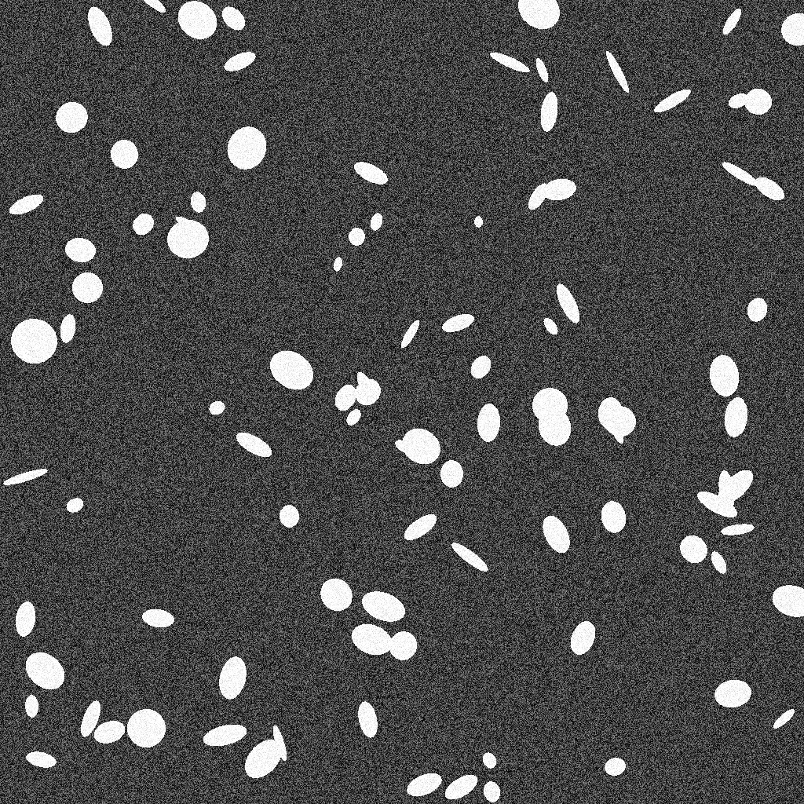
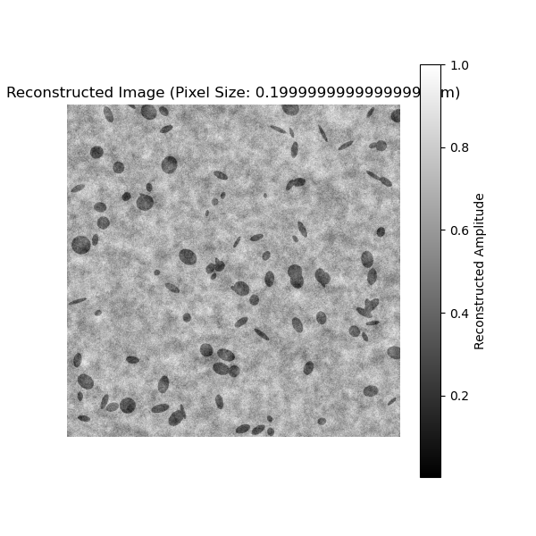
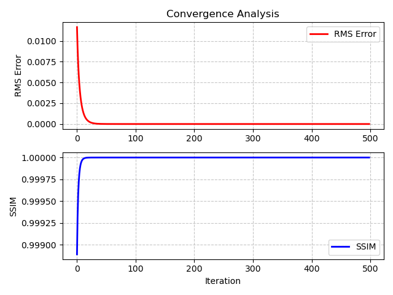
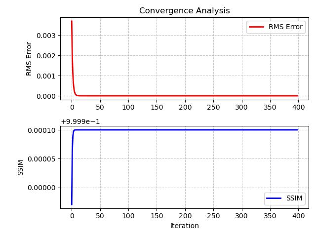
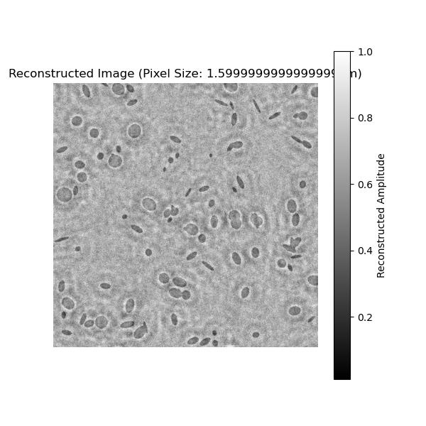
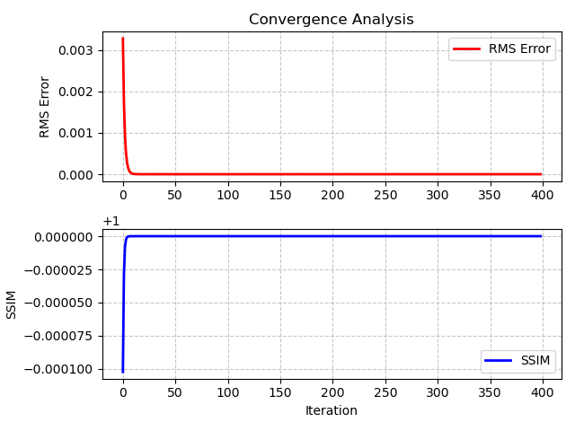
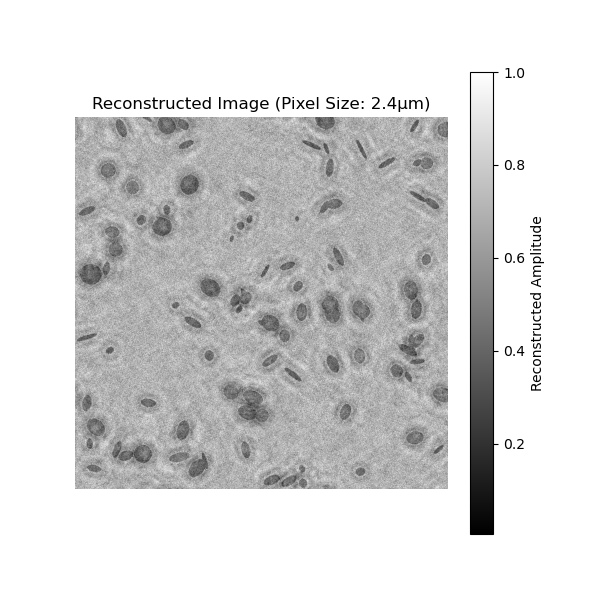
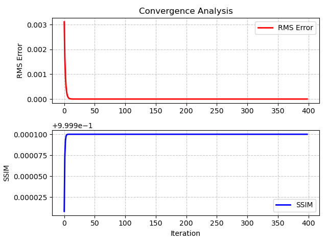

# Under-sampling simulation

## Sample 

It is a random generated sample with $1024 \times 1024$ resolution. I added some white Guassian noise to simulate the random noise while imaging. Due to in lensless microscope the FOV is equal to the active area on the sensor chip which is nearly equal to the size of the sample. So the **FOV** here is $204.8\mu m \times 204.8\mu m$ .

    <figure>
        
    </figure>

## Shannon sampling criteria

If we want to recover the signal without any loss we must obey the Shannon sampling criteria, so we can have the minimum sampling distance by as follows: 

$$K_{max}=\frac{2\pi}{\lambda_{min}}\rightarrow f_{max}=\frac{k_{max}}{2\pi}=\frac{1}{\lambda}\rightarrow \Delta x \leq \frac{\lambda_{min}}{2}$$

I assume we use the light of wavelength at $532nm$, so we can get **the minimum sampling distance** $\Delta x = 0.266 \mu m$

## Simulation method

I want to achieve the following effect:

1. 

## Test 1 with 5mm sample-sensor distance

**1. Ideal case with $0.2 \mu m$ pixel size**

$$
\begin{array}{c|c}
\textbf{RMS} & \textbf{SSIM} \\
\hline
2.47 \times 10^{-16} & 0.9999
\end{array}
$$

    <figure>
        
        <figcaption>Figure 1.1: Sample reconstructed</figcaption>
    </figure>

    <figure>
        
        <figcaption>Figure 1.2: Convergence figure</figcaption>
    </figure>

**2. Under-sampling with $0.8 \mu m$ pixel size**

$$
\begin{array}{c|c}
\textbf{RMS} & \textbf{SSIM} \\
\hline
2.63 \times 10^{-16} & 0.9999
\end{array}
$$

    <figure>
        
        <figcaption>Figure 2.1: Sample reconstructed</figcaption>
    </figure>

    <figure>
        
        <figcaption>Figure 2.2: Convergence figure</figcaption>
    </figure>

🚩**3. Under-sampling with $1.6 \mu m$ pixel size**

$$
\begin{array}{c|c}
\textbf{RMS} & \textbf{SSIM} \\
\hline
2.54 \times 10^{-16} & 0.9999
\end{array}
$$

    <figure>
        
        <figcaption>Figure 3.1: Sample reconstructed</figcaption>
    </figure>

    <figure>
        
        <figcaption>Figure 3.2: Convergence figure</figcaption>
    </figure>

**4. Under-sampling with $2.4 \mu m$ pixel size**

$$
\begin{array}{c|c}
\textbf{RMS} & \textbf{SSIM} \\
\hline
2.66 \times 10^{-16} & 0.9999
\end{array}
$$

    <figure>
        
        <figcaption>Figure 4.1: Sample reconstructed</figcaption>
    </figure>

    <figure>
        
        <figcaption>Figure 4.2: Convergence figure</figcaption>
    </figure>

## Conclusion

    <figure style="margin: 10px; text-align: center;">
        
        <figcaption>Ideal case</figcaption>
    </figure>
    <figure style="margin: 10px; text-align: center;">
        
        <figcaption>0.8 micrometer</figcaption>
    </figure>
        <figure style="margin: 10px; text-align: center;">
        
        <figcaption>1.6 micrometer</figcaption>
    </figure>
        <figure style="margin: 10px; text-align: center;">
        
        <figcaption>2.4 micrometer</figcaption>
    </figure>

