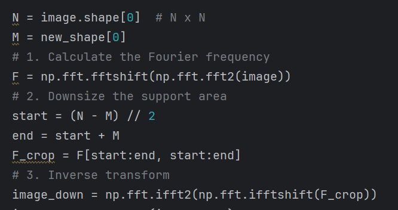
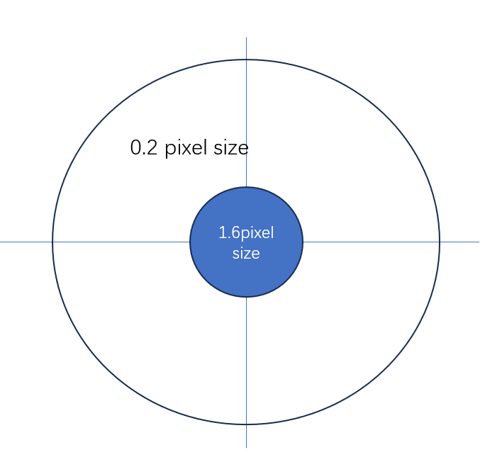

<head>
  
  
  
</head>

- [Review](#review)
- [Question](#question)
- [Noise simulation](#noise-simulation)

## Review

In previous, I made several mistakes. 

1. **The noise simulation problem**
   
   I missed the ACD noise which is introduced when the equipment converts the analog signal to digital signal. I thought that the shot noise always takes the dominant in the reconstruction but I forgot that when the sample is not transparent it would be like low light condition so other noises' ratio like dark current noise, ACD noise and readout noise would increase so at this time they might take the dominant.

2. **The interpolation problem**
   
   I do the interpolation on the sensor plane to extend it to the same resolution with the sample plane. This will have such problems:

   1) I actually made up sampling although the interpolation values are all 0. This will cause problems like artifacts. 
   2) For the physical reason, light field propagation can be viewed as modulating the spatial spectrum of the object field through a transfer function however this transfer function is usually band-limited in the frequency domain $f_x^2 + f_y^2 \leq \frac{1}{\lambda ^2}$ . The high-frequency part of the object is cut off during the transmission process, leaving only the low-frequency component. 
   
   **As a result, we should do downsampling in the object plane to more faithfully reflects the limited frequency spectrum captured by the sensor.**

3. **I didn't get the goal of this simulation.**
   
   It is to find a standard to verify if the set up works well rather than just to see what's the reconstruction result when under sampling.

## Question

1. Q1: Downsampling on the sample
   
   Due to the spectrum support limit: $f_x^2 + f_y^2 \leq \frac{1}{\lambda ^2}$ . Because of the sensor limit, we will lose huge amount of high frequency information. When we downsize the sample, can we use this method below? This method has problems too for example we lose lots of energy.

   

       <figure>
           
       </figure>
   

      

       <figure>
           
       </figure>
   

## Noise simulation

The full well capacity for IMX477 is around 8000 $e^-$ . 
   